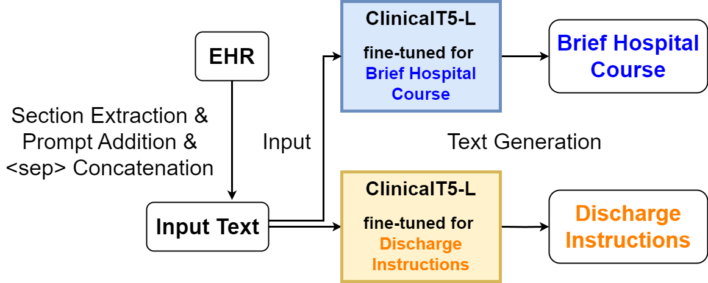

# Shimo Lab at "Discharge Me!": Discharge Summarization by Prompt-Driven Concatenation of Electronic Health Record Sections
- Code for paper **Shimo Lab at "Discharge Me!": Discharge Summarization by Prompt-Driven Concatenation of Electronic Health Record Sections**
- paper: [cite]()  
- Authors: Yunzhen He<sup>\*, 1</sup>, Hiroaki Yamagiwa<sup>\*, 1</sup>,  Hidetoshi Shimodaira<sup>1, 2</sup>
- <sup>\*</sup> The first two authors contributed mainly and equally to this work
- <sup>1</sup> Kyoto University, <sup>2</sup> RIKEN AIP
- Workshop page: https://stanford-aimi.github.io/discharge-me/
- Our fine-tuned model page 🤗: 

# Overview💡

Overview of our pipeline. To create input text, we extract sections from the EHR, add explanatory prompts, and then concatenate them with \<sep> tokens. We then generate discharge summaries using ClnicalT5-large, which has been fine-tuned for each target.
  
# Setups🛠️
- **For coding environment**
```python
pip install transformers==4.39.3
pip install torch==2.2.1
```
- **For raw data preprocessing**
Please use the script [data_factory/cv_split.py](data_factory/cv_split.py) to make input data. Remember to use [data_factory/make_text_without_target.py](data_factory/make_text_without_target.py) to remove the target from the train, validation, and test datasets❗️
- **For Implementing Scoring Metrics**
  We utilize the official scoring metrics available at [Stanford-AIMI/discharge-me/scoring](https://github.com/Stanford-AIMI/discharge-me/blob/main/scoring). To accurately calculate scores, please first review and implement the required components as specified in the guidelines.

# Experiments🔬
We employ the [ClinicalT5-Large](https://aclanthology.org/2022.findings-emnlp.398.pdf)[1] model for our tasks. To fine-tune this model, utilize the provided [train.py](train.py) script as demonstrated below:

```python
python train.py --fold=1 --batch_size=2 --target="brief_hospital_course" --model_name="luqh/ClinicalT5-large"
```
After fine-tuned model, you can use generate text like:
```python
import pandas as pd
from generation import generate_summary

# Please provide the path for the input file.
df_input = ""

# Generate summary for "brief hospital course"
# Please provide the path of the fine-tuned model for brief hospital course.
model_name = ""
summary1 = generate_summary(df_input=df_input, model_name=model_name, target="brief_hospital_course")

# Generate summary for "discharge instructions"
# Please provide the path of the fine-tuned model for discharge instructions.
model_name = ""
summary2 = generate_summary(df_input=df_input, model_name=model_name, target="discharge_instructions")
```

# Evaluation📊
The over-all score is calculated by first averaging the eight scores for each target, then averaging the values for the two targets.

You can use this to calculate you score:
```python
from metrics import compute_overall_score
 
# Please provide the data of the generated summaries
# Please provide the data of the reference text
score = compute_overall_score(rows_ref=, rows_gen=):
print(score)
```

If you didn't implement the official scoring metrics, please take a look at https://github.com/Stanford-AIMI/discharge-me/blob/main/scoring.

# Reference
> [1] Qiuhao Lu, Dejing Dou, Thien Huu Nguyen: **ClinicalT5: A Generative Language Model for Clinical Text.** EMNL(Findings) 2022: 5436-5443


# Citation
Please cite our paper if it's help for your work!
@